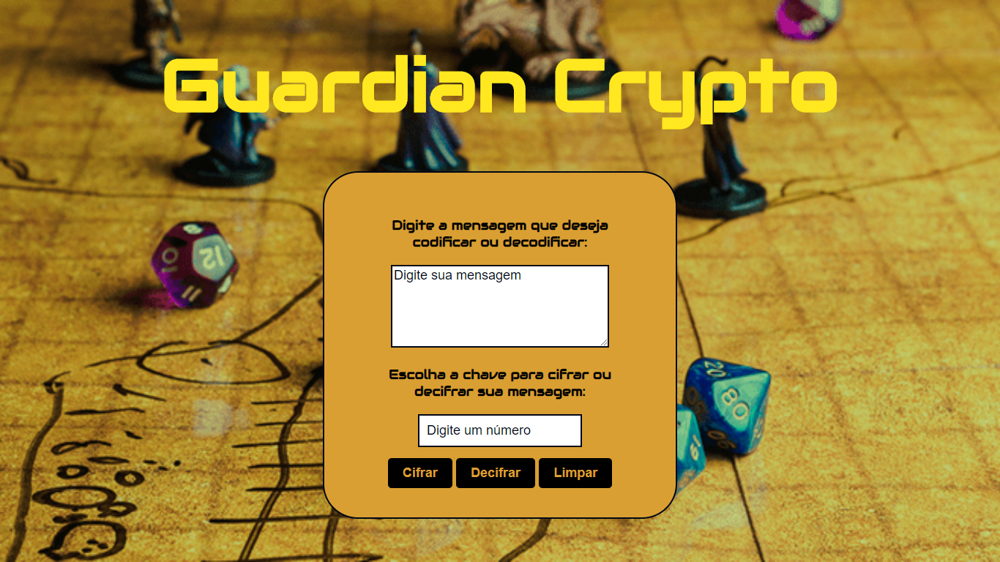

# Guardian Crypto

## Índice

* [1. Definição do Produto](#1-definicao-do-produto)
* [2. Introdução do usuário ao Jogo](#2-introducao-do-usuario-ao-jogo)
* [3. Interface do Produto](#3-interface-do-produto)
* [4. Método de cifragem usado no projeto:](#4-metodo-de-cifragem-usado-no-projeto)
* [5. Aprendizagem](#6-aprendizagem)
* [6. Especificações técnicas](#7-especificacoes-tecnicas)

***

## 1. Definição do Produto

Inspirado nos jogos de RPG (_role-playing game_), um tipo de jogo aonde os jogadores assumem papéis dos personagens dentro de um mundo de fantasia, para que possam criar o próprio jogo aonde desejam se comunicar com mensagens secretas entre eles, para que um time não possa tomar conhecimento da estratégia do outro. Sendo assim, tendo a necessidade de um lugar onde podem criptografarem e descriptografarem mensagens, com o objetivo de vencerem o jogo.

## 2. Introdução do usuário ao Jogo

Erberus... 
Um lugar pacífico e calmo desde os primordios de sua criação, habitada por uma variedade de raças todos viviam pacificamente, conflitos eram raros e quando ocorriam, rapidamente eram solucionados, porém, isso tudo mudou em um dia, 
dia esse que ficou conhecido como _"The Prague Day"_. Esse foi nada mais e nada menos que o dia em que sugiu a raça que quebrou o equilibrio que reinava na terra, raça essa conhecida como `*"Humanos"`. Os Humanos eram uma raça ambiciosa, traçoiera, e se necessario assasina, guerras foram cravadas pela busca de poder, um lugar que antes era pacífico passa a ter longos periodos sangrentos. Contudo existia um reino que queria o equilibrio na terra que fora tirado, esse reino era `*"Drakharian"`.  O mestre ancião dos Drakharian era responsável por guardar uma mensagaem em _enigma_ advindo dos antepassados, que previa uma rebelião entre raças. E para reestabelecer o equilibrio e conter as forças malignas da raça Humana, teriam que descobrir o mensagem _criptografada_ pela `*"Cifra de César"` que continha informações cruciais para o desfecho da batalha. 
 
* O objetivo é: A raça que acessar o enigma primeiro ganha.

Que começem os jogos!

## 3. Interface do Produto

A interface permite ao usuário:

* Inserir uma mensagem (texto) para ser cifrada.
* Eleger um (offset) indicando quantas posições de deslocamento de caracteres quer que a cifra utilize.
* Ver o resultado da mensagem cifrada clicando no botão Cifrar.
Na mesma tela, ver o resultado da mensagem decifrada clicando no botão Decifrar.
* Limpar o resultado da tela.

## 4. Método de Aprendizagem usado no projeto:

Cifrar significa codificar. A [cifra de
César](https://pt.wikipedia.org/wiki/Cifra_de_C%C3%A9sar) é um dos primeiros
tipos de criptografias conhecidas na história. O imperador romano Júlio César
utilizava essa cifra para enviar ordens secretas aos seus generais no campo de
batalha.

Acesse a página em:
![guardian-cripto] (https://alessandramarinho.github.io/SAP004-cipher/src/)

A cifra de César é uma das técnicas mais simples de cifrar uma mensagem. É um
tipo de cifra por substituição, em que cada letra do texto original é
substituida por outra que se encontra há um número fixo de posições
(deslocamento) mais a frente do mesmo alfabeto.

Por exemplo se usarmos o deslocamento (_offset_) de 3 posições:

* Alfabeto sem cifrar: A B C D E F G H I J K L M N O P Q R S T U V W X Y Z
* Alfabeto com cifra:  D E F G H I J K L M N O P Q R S T U V W X Y Z A B C
* A letra A será D
* A palavra CASA será FDVD

Atualmente todas as cifras de substituição alfabética simples, são decifradas
com facilidade e não oferecem muita segurança na comunição, mas a cifra de César
muitas vezes pode fazer parte de um sistema mais complexo de criptografia, como
a cifra de Vigenère, e tem aplicação no sistema ROT13.

## 5. Aprendizagem

Neste projeto aprendi a construir uma aplicação web que interage com o usuário, a desenvolver formulário, usar condicionais, a implementar testes e soluciona-los. Principalmente a organização de tempo e tarefas para otimizar tempo.

## 6. Especificações técnicas

Para o desenvolvimento do projeto foram utilizados:

* HTML - usado para estruturar o conteúdo da página;
* CSS - usado para estilizar a página;
* JavaScript - usado para a fazer a interação do usuário com a página.
* Testes - Todos os testes unitários estão cobrindo 100%. E cumpri os desafios do Hacker Edition.